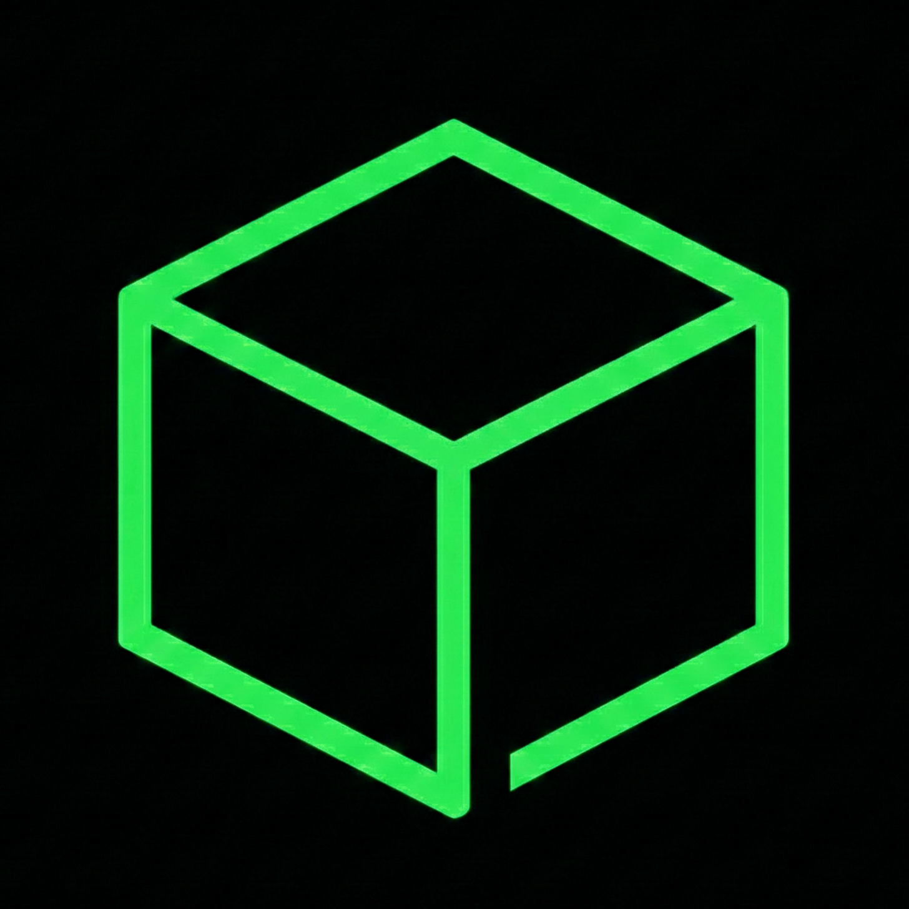
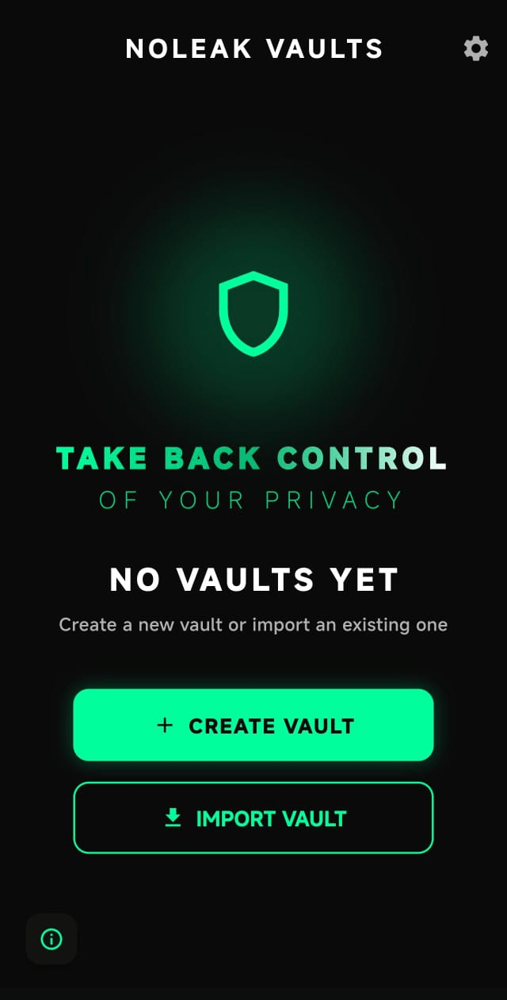

# NoLeak Vault

<p align="center">
  
</p>

<p align="center">
  <strong>Take Back Control of Your Privacy</strong>
</p>

<p align="center">
  A zero-knowledge encrypted vault for Android. Your files stay on your device, encrypted with keys only you control.
</p>

<p align="center">
  
</p>

<p align="center">
  🎨 <em>Modern UI with Green Cyberpunk Theme</em>
</p>

<p align="center">
  <a href="#download">Download</a> •
  <a href="#features">Features</a> •
  <a href="#security">Security</a> •
  <a href="#architecture">Architecture</a> •
  <a href="#building-from-source">Build</a> •
  <a href="#contributing">Contributing</a>
</p>

---

## Download

### 📱 Pre-built APK

<p align="center">
  <a href="https://github.com/richoarbianto/noleak/releases/latest">
    
  </a>
</p>

| Version | Download | Size | Min Android |
|:-------:|:--------:|:----:|:-----------:|
| v1.0.0 | [📥 noleak.apk](https://github.com/richoarbianto/noleak/releases/download/v1.0.0-stable/noleak.apk) | ~56 MB | Android 10+ |

> ⚠️ Since this APK is not from Play Store, enable "Install from unknown sources" in your Android settings.

---

## Overview

NoLeak is an offline-first encrypted vault built with Flutter and native Android (Kotlin/C). All cryptographic operations happen locally using libsodium. No servers, no cloud sync, no telemetry.

**Zero-knowledge architecture**: Your passphrase never leaves the device. We can't recover your data if you forget it.

## Features

### 🔐 Encryption
- **XChaCha20-Poly1305** authenticated encryption (256-bit keys)
- **Argon2id** key derivation with adaptive memory cost (32-256 MB based on device RAM)
- Per-file encryption keys (DEK) wrapped by master key (MK)
- All crypto via [libsodium](https://libsodium.org/)

### 🛡️ Security Layers
- Root/Magisk detection
- Emulator and debugger detection
- Frida/Xposed hooking detection
- Screenshot prevention (FLAG_SECURE)
- Biometric authentication required for vault unlock
- Progressive brute-force lockout (30s → 1hr)
- Secure memory handling (mlock + zeroization)

### 📁 File Management
- Import files and entire folders
- Virtual folder organization within vault
- Streaming import for large files (up to 50GB, chunked to avoid OOM)
- In-memory media playback (no temp files on disk)
- Export encrypted vault containers for backup

### 🎬 Media Support
- Images: JPEG, PNG, GIF, WebP
- Videos: MP4, MKV, WebM (chunk-based decryption)
- Audio: MP3, M4A, WAV
- Documents: PDF, DOCX, XLSX, PPTX (text preview for Office)
- Text files with UTF-8 preview (1MB cap, no highlighting)

### 🔄 Multi-Vault
- Up to 25 independent vaults
- Each vault has its own passphrase
- Encrypted vault titles (revealed only after authentication)
- Import/export vaults between devices

## Security

### Key Hierarchy

```
Passphrase
    │
    ▼ Argon2id (salt, adaptive memory 32-256MB)
   KEK (Key Encryption Key) ─── ephemeral, zeroized after use
    │
    ▼ XChaCha20-Poly1305 unwrap
   MK (Master Key) ─── stored encrypted in vault header (journaled A/B slots)
    │
    ▼ XChaCha20-Poly1305 unwrap
   DEK (Data Encryption Key) ─── per-file, stored in encrypted index
    │
    ▼ XChaCha20-Poly1305 encrypt
   Encrypted File Data (chunked for streaming)
```

### Cryptographic Primitives

| Component | Algorithm | Notes |
|:----------|:----------|:------|
| Symmetric Encryption | XChaCha20-Poly1305 | 256-bit key, 192-bit nonce, AEAD |
| Key Derivation | Argon2id | Memory-hard, side-channel resistant |
| Random Generation | libsodium randombytes | CSPRNG |
| Hashing | SHA-256 | Legacy container hash (best-effort, not required to unlock) |

### Adaptive KDF Parameters

| Device RAM | Memory Cost | Iterations |
|:-----------|:------------|:-----------|
| ≥4 GB | 256 MB | 12 |
| 2-4 GB | 128 MB | 10 |
| <2 GB | 32 MB | 3 |

### Security Checks

The app performs these checks before allowing vault operations:

- `su` binary detection in common paths
- Magisk artifacts detection
- Root management apps detection
- Debugger attachment check (`TracerPid`)
- Hooking libraries in `/proc/self/maps`
- Frida server detection
- ADB/USB debugging status
- Emulator fingerprint detection
- Bootloader lock state
- APK signature verification
- Test-keys build detection

If any check fails, vault operations are blocked.

### Session Security

- Idle timeout: 10-30 seconds (configurable)
- Session limit: 3-10 minutes (configurable)
- Auto-lock on app background
- Timers pause during file operations to prevent data loss

## Architecture

### Project Structure

```
noleak/
├── lib/                              # Flutter/Dart
│   ├── main.dart                     # Entry point
│   ├── models/
│   │   ├── vault_info.dart           # Vault metadata
│   │   └── vault_state.dart          # State enum, VaultEntry
│   ├── screens/
│   │   ├── vault_dashboard_screen.dart   # Multi-vault list
│   │   ├── vault_home_screen.dart        # File browser
│   │   ├── unlock_vault_screen.dart      # Passphrase entry
│   │   ├── video_player_screen.dart      # Encrypted video playback
│   │   ├── audio_player_screen.dart      # Encrypted audio playback
│   │   ├── image_viewer_screen.dart      # Encrypted image display
│   │   └── text_viewer_screen.dart       # Text file viewer
│   ├── services/
│   │   ├── vault_channel.dart        # MethodChannel bridge
│   │   ├── vault_state_manager.dart  # State + session management
│   │   ├── vault_registry.dart       # Multi-vault registry
│   │   └── app_settings.dart         # User preferences
│   ├── widgets/
│   │   ├── secure_keyboard.dart      # On-screen keyboard
│   │   └── password_strength_meter.dart
│   └── utils/
│       ├── secure_passphrase.dart    # Secure string handling
│       └── secure_logger.dart        # Debug-only logging
│
├── android/app/src/main/
│   ├── kotlin/com/noleak/noleak/
│   │   ├── MainActivity.kt           # FLAG_SECURE, lifecycle
│   │   ├── VaultPlugin.kt            # MethodChannel handler
│   │   ├── vault/
│   │   │   ├── VaultEngine.kt        # JNI wrapper
│   │   │   ├── VaultBridge.kt        # High-level API
│   │   │   └── VaultRegistry.kt      # Multi-vault management
│   │   ├── security/
│   │   │   ├── SecurityManager.kt    # Security enforcement
│   │   │   ├── RootGate.kt           # Root/tamper detection
│   │   │   └── PasswordRateLimiter.kt
│   │   ├── video/
│   │   │   └── VaultMediaDataSource.kt   # Encrypted video source
│   │   └── audio/
│   │       ├── VaultAudioDataSource.kt   # Encrypted audio source
│   │       └── VaultChunkedAudioDataSource.kt # Chunked audio source
│   │
│   └── cpp/                          # Native C (libsodium)
│       ├── vault_engine.h            # API definitions
│       ├── vault_crypto.c            # KDF, AEAD
│       ├── vault_container.c         # File format, header
│       ├── vault_index.c             # Encrypted file index
│       ├── vault_streaming.c         # Large file streaming
│       └── vault_jni.c               # JNI bindings
```

### Technology Stack

| Layer | Technology |
|:------|:-----------|
| UI | Flutter 3.x / Dart |
| Native Bridge | Kotlin + MethodChannel |
| Cryptography | libsodium (C) |
| Key Storage | Android Keystore |
| Biometrics | AndroidX Biometric |
| Media | MediaPlayer + MediaDataSource |

### Vault File Format

```
┌──────────────────────────────────────┐
│ Journal Header (A/B)                 │
│  - Superblock: "VAULTJ1", version    │
│  - Slot 0/1: seq, KDF params, MK     │
│  - Slot CRC32                        │
├──────────────────────────────────────┤
│ Encrypted Index                      │
│  - Nonce (24 bytes)                  │
│  - Ciphertext length                 │
│  - Encrypted file entries            │
│    (file IDs, names, DEKs, offsets)  │
├──────────────────────────────────────┤
│ Encrypted Data Blobs                 │
│  - Per-file: nonce + ciphertext      │
│  - Chunks (legacy 1MB, stream 4MB)   │
├──────────────────────────────────────┤
│ Integrity Hash (SHA-256)             │
└──────────────────────────────────────┘
```


## Building from Source

### Prerequisites

- Flutter SDK 3.0+
- Android NDK 25+
- JDK 17+

### Build Steps

```bash
# Clone
git clone https://github.com/richoarbianto/noleak.git
cd noleak

# Dependencies
flutter pub get

# Build libsodium (first time)
cd android/app/src/main/cpp
./build_libsodium.sh
cd ../../../../..

# Run debug
flutter run

# Build release APK
flutter build apk --release
```

Output: `build/app/outputs/flutter-apk/app-release.apk`

## Contributing

### Guidelines

1. Security is non-negotiable. All changes must maintain or improve security posture.
2. No network code. The app must remain fully offline.
3. Zeroize sensitive data. Use `vault_zeroize()` in C, `SecurePassphrase.clearController()` in Dart.
4. All PRs require review.

### Code Style

- Dart: [Effective Dart](https://dart.dev/guides/language/effective-dart)
- Kotlin: [Kotlin Conventions](https://kotlinlang.org/docs/coding-conventions.html)
- C: Document all functions, consistent formatting

## License

See [LICENSE](LICENSE).

## Acknowledgments

- [libsodium](https://libsodium.org/) - Cryptographic primitives
- [Flutter](https://flutter.dev/) - UI framework
- Android MediaPlayer - Media playback

---

<p align="center">
  <strong>Your files. Your keys. Your device.</strong>
</p>
