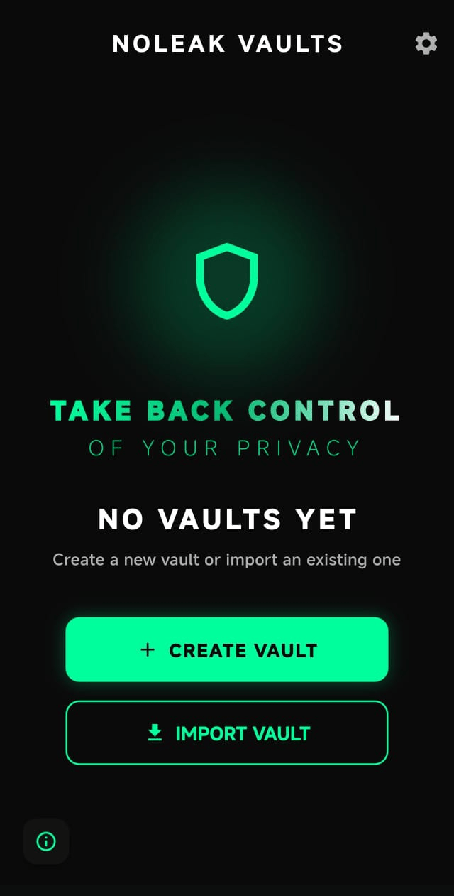

# NoLeak Vault

<p align="center">
  
</p>

<p align="center">
  <strong>Local-first encrypted file vault for Android</strong>
</p>

<p align="center">
  NoLeak keeps files inside encrypted containers on the device. It is built with Flutter, Kotlin, native C, and libsodium, and the Android app explicitly excludes internet access.
</p>

<p align="center">
  
</p>

<p align="center">
  <a href="https://github.com/richoarbianto/noleak/releases/latest">Download latest APK</a>
  ·
  <a href="#features">Features</a>
  ·
  <a href="#security-model">Security model</a>
  ·
  <a href="#build-from-source">Build</a>
</p>

---

## Status

NoLeak is an Android-only project under active development. The current application version is `1.0.2` (`versionCode 1002`) and requires Android 7.0/API 24 or newer.

Packaged releases are available from [GitHub Releases](https://github.com/richoarbianto/noleak/releases/latest).

NoLeak has no cloud sync, remote account, server-side recovery, or passphrase reset. Losing a vault passphrase means losing access to that vault.

## Features

### Vault management

- Create and manage up to 25 independent vaults.
- Assign a private title to each vault.
- Change a vault passphrase after verifying the current one.
- Export an encrypted vault container for backup and import it later.
- Delete a vault with password verification, rate limiting, best-effort overwrite, and registry cleanup.
- Show the encrypted container size for each vault on the dashboard.

### File and folder management

- Import individual files through Android's Storage Access Framework (SAF).
- Recursively import folders while preserving their relative structure.
- Create virtual folders inside a vault.
- Search, rename, move, copy, export, and delete files.
- Rename or recursively delete folders and their contents.
- Export individual files as plaintext only after an explicit warning; encrypted vault export remains a separate workflow.

### Secure previews and playback

- Image viewer for supported image formats.
- Bounded text and key-file previews.
- PDF pages rendered through Android's native PDF renderer without creating a plaintext PDF cache file.
- Text extraction previews for DOCX, XLSX, and PPTX with archive, entry-size, and output limits.
- Audio and video playback backed by vault-aware Android media data sources.
- Decrypted buffers and media sessions are cleared when viewers close or the vault locks.

### Large-file handling

- Files larger than 10 MiB use the resumable streaming import path.
- Streaming imports support files up to 50 GiB.
- Source sampling, exact resume offsets, ordered chunk validation, and final byte-count checks prevent resuming from the wrong position.
- Encryption and final container commit use bounded buffers instead of materializing the complete file in RAM.
- Interrupted encrypted chunks can be resumed after the user selects the same source again.

### Locking and authentication

- Vault unlock requires both the vault passphrase and biometric authentication.
- Optional biometric app lock can protect application launch separately from vault unlock.
- Configurable idle auto-lock: 10, 15, 20, or 30 seconds.
- Configurable biometric session re-authentication: 3, 5, or 10 minutes.
- Secure on-screen keyboard is enabled by default and can be disabled in settings.
- Persistent per-vault backoff protects app-mediated password checks, including open, verify, title changes, password changes, and deletion. After five failures, lockout starts at one minute and doubles up to 30 minutes.

## Supported imports

NoLeak can store any non-empty file type up to 50 GiB. MIME metadata selects
the best available viewer; it does not block import.

| Category | Formats |
| --- | --- |
| Images | JPEG, PNG, WebP |
| Video | MP4, MKV |
| Audio | MP3, M4A/MP4 audio, AAC, WAV, OGG, OPUS, FLAC |
| Documents | PDF, DOCX, XLSX, PPTX |
| Text and keys | TXT, PEM, SSH public keys, PGP/ASC, PKCS#8 |
| Other formats | Sanitized raw preview, limited to 4,096 characters |

Playback and rich rendering still depend on Android device codec and platform
support. When no dedicated viewer is available, NoLeak decrypts only a bounded
prefix for the raw preview and does not create a plaintext temporary file.

## Operational limits

| Limit | Current value |
| --- | --- |
| Vaults per installation | 25 |
| Maximum imported file size | 50 GiB |
| Streaming import threshold | More than 10 MiB |
| Whole-file in-memory viewer limit | 64 MiB |
| Office preview output | 200,000 characters |
| Raw preview output | 4,096 characters (16 KiB input cap) |

Video and PDF use streaming/page-based paths. Image, Office, and audio flows that require a complete in-memory buffer reject files above the 64 MiB viewer limit instead of risking an out-of-memory crash.

Streaming import is memory-bounded, but its crash-safe final commit uses both encrypted pending chunks and an atomic temporary container. Before importing a file of size `N`, plan for roughly `current vault size + 2N` of free storage at peak.

## Security model

NoLeak protects data at rest while the vault is locked and the encrypted container remains intact. It uses local cryptography as the primary boundary and Android runtime checks as defense in depth.

Implemented controls include:

- no Android `INTERNET` permission;
- Android backup and data extraction disabled;
- XChaCha20-Poly1305 authenticated encryption through libsodium;
- Argon2id passphrase derivation; new vaults select 64, 128, or 256 MiB from current Android memory signals and process architecture, while existing vaults always use the exact parameters stored in their header. The current libsodium `crypto_pwhash` API uses effective parallelism 1; legacy NoLeak headers containing 2 remain readable because older builds stored that value without applying it;
- imported vault headers are validated before registration, and the app warns when their memory or work-factor profile exceeds the profile selected for the current device;
- a random vault master key wrapped by the passphrase-derived key;
- a separate random data-encryption key for each file, wrapped by the vault master key;
- authenticated file data and an authenticated encrypted index, plus a SHA-256 container consistency hash;
- Android Keystore and AndroidX Biometric integration for biometric-gated flows;
- passphrases transported through app-controlled Dart, Kotlin, and JNI APIs as mutable UTF-8 byte buffers that are zeroized after use;
- native key and plaintext-buffer zeroization, with best-effort `sodium_mlock` protection for the in-memory master key;
- persistent per-vault password backoff for attempts made through the app;
- lifecycle, idle, and session locking with native key cleanup;
- Android `FLAG_SECURE` to reduce screenshots and screen recording;
- overlay hiding on supported Android versions and rejection of obscured touch events;
- fail-closed checks for root/Magisk artifacts, Frida/hooking, debuggers, tracing, ADB, emulators, bootloader state, install source, build tags, and signing certificate;
- release minification and debug-only logging wrappers intended to avoid sensitive production logs.

Runtime tamper checks can produce device-specific compatibility failures and cannot make a compromised operating system trustworthy. They do not replace strong passphrases, current Android security updates, or safe device handling. Secure deletion on flash storage is best effort because wear leveling can retain physical copies outside application control.

The app lockout is not an offline-attack boundary. Anyone who obtains a copy of a vault container can test passphrase candidates outside NoLeak without its SharedPreferences counter. Offline resistance therefore depends on the stored Argon2id cost and a strong, unique passphrase. A memory-allocation failure while opening an existing high-cost vault is reported separately and never retried with different KDF parameters.

Memory clearing is best effort across managed runtimes and platform-channel serialization; it reduces secret lifetime but cannot prove that every transient framework copy was overwritten. Revealing a passphrase also requires a temporary displayable string until the field is hidden again.

## Cryptography and container format

```text
Passphrase
  └─ Argon2id + random salt → key-encryption key (KEK)
       └─ unwrap random vault master key
            └─ unwrap per-file data-encryption key (DEK)
                 └─ decrypt authenticated file data/chunks
```

| Area | Implementation |
| --- | --- |
| Content encryption | XChaCha20-Poly1305 |
| Key derivation | Argon2id |
| Randomness | libsodium CSPRNG |
| Container index | Authenticated encryption with file/chunk offsets and metadata |
| Container consistency | SHA-256 over container contents; AEAD tags authenticate encrypted data and metadata |
| Registry metadata | Android Keystore-backed encryption |
| Biometrics | AndroidX Biometric / Android Keystore |

The native container stores its header, wrapped master key, encrypted index, and encrypted payloads in one file. Metadata-only changes use atomic temporary-file replacement and only update in-memory offsets after the new container is durable. `VAULTv1` is the current format; legacy `VAULTJ1` containers are accepted and migrated to the current layout when opened successfully.

## Project layout

```text
lib/
  main.dart                         Flutter application entry point
  models/                           Vault and file metadata models
  screens/                          Dashboard, file manager, settings, and viewers
  services/                         Dart state, settings, progress, and native channel APIs
  widgets/                          Secure keyboard and reusable UI components
  utils/                            Logging and passphrase helpers

android/app/src/main/kotlin/
  com/noleak/noleak/MainActivity.kt Android lifecycle and window hardening
  com/noleak/noleak/VaultPlugin.kt  Flutter ↔ Android MethodChannel boundary
  com/noleak/noleak/security/       Environment checks, Keystore, and rate limiting
  com/noleak/noleak/vault/          Vault bridge, registry, SAF, and streaming import
  com/noleak/noleak/audio|video/    Vault-aware media playback adapters

android/app/src/main/cpp/
  vault_crypto.c                    libsodium crypto and file-wipe wrappers
  vault_container.c                 Container read/write and atomic commit logic
  vault_engine.c                    Global native vault state and lifecycle
  vault_index.c                     File operations and encrypted index handling
  vault_streaming.c                 Resumable chunk encryption and finalization
  vault_jni.c                       Core JNI bindings
  vault_streaming_jni.c             Streaming JNI bindings
```

## Build from source

Requirements:

- Flutter SDK compatible with Dart `^3.5.2`.
- Android SDK with compile SDK 35.
- Android NDK `25.1.8937393`.
- CMake 3.22.1.
- JDK 17; Android Studio's bundled JBR is recommended.

Fetch packages and run local checks:

```bash
flutter pub get
flutter analyze lib
flutter test
```

Debug builds compile, but runtime security checks intentionally reject debuggable packages. Use a correctly signed release build to exercise the complete vault flow on a supported physical device.

## Release build

Release builds require a private signing key and an explicit certificate allowlist. Create `android/key.properties` or provide the equivalent `NOLEAK_*` environment variables:

```properties
storeFile=app/your-release-key.jks
storePassword=...
keyAlias=...
keyPassword=...
```

Set `NOLEAK_SIGNATURE_SHA256` to the uppercase 64-character SHA-256 digest of the release signing certificate, without colon separators. Multiple accepted certificates can be comma-separated.

```bash
export JAVA_HOME="/Applications/Android Studio.app/Contents/jbr/Contents/Home"
export NOLEAK_SIGNATURE_SHA256="AABBCCDD..."
flutter build apk --release
```

Release APK output:

```text
build/app/outputs/flutter-apk/app-release.apk
```

Recommended artifact verification:

```bash
apksigner verify --verbose --print-certs build/app/outputs/flutter-apk/app-release.apk
shasum -a 256 build/app/outputs/flutter-apk/app-release.apk
```

Never commit keystores, signing passwords, `android/key.properties`, or environment files containing release credentials.

## Security contribution rules

- Do not add network access unless the threat model and this README are updated.
- Do not log passphrases, keys, decrypted bytes, vault plaintext, or full sensitive paths.
- Avoid plaintext temporary files. If one is unavoidable, document its lifecycle and cleanup.
- Keep vault format changes backward-compatible or provide an explicit migration.
- Preserve fail-closed behavior at authentication, environment, and persistence boundaries.
- Treat runtime tamper checks as defense in depth, not as the primary security boundary.

## License

NoLeak Vault is released under the BSD 3-Clause License. See [LICENSE](LICENSE).
